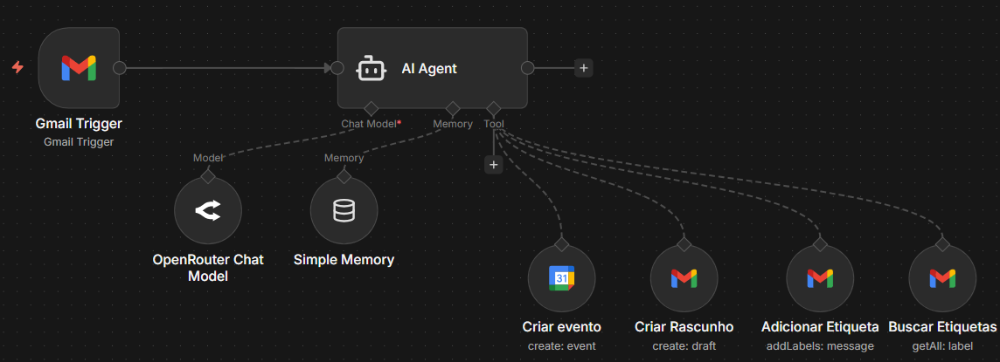

# Case de Portfólio — AI Email Agent com n8n

## 🎯 Contexto do Problema

A gestão de emails é uma atividade essencial, porém altamente repetitiva. Em caixas de entrada com grande volume de mensagens, é comum enfrentar problemas como:

- Emails sem resposta
- Falta de organização e priorização
- Perda de tempo com tarefas operacionais
- Agendamentos feitos manualmente
- Dificuldade em padronizar respostas

O desafio deste projeto foi criar uma solução capaz de **interpretar emails automaticamente**, tomar decisões e executar ações de forma autônoma.

---

## 💡 Solução Proposta

Foi desenvolvido um **Agente de Inteligência Artificial utilizando o n8n**, capaz de atuar como um assistente inteligente de caixa de entrada.

O agente é responsável por:
- Analisar o conteúdo dos emails recebidos
- Identificar a intenção da mensagem
- Decidir quais ações devem ser executadas
- Interagir com ferramentas externas como Gmail e Google Calendar
- Manter um contexto básico para decisões futuras

---

## 1) Arquitetura da Solução

### Componentes principais

- **Gmail Trigger**
  - Inicia o workflow automaticamente ao receber um novo email

- **AI Agent (LLM via OpenRouter)**
  - Interpreta o conteúdo do email
  - Classifica a intenção da mensagem
  - Decide quais ferramentas devem ser utilizadas

- **Ferramentas integradas**
  - Google Calendar — Criação automática de eventos
  - Gmail Draft — Criação de rascunhos de resposta
  - Gmail Labels — Organização automática da caixa de entrada

- **Simple Memory**
  - Armazena contexto básico para apoiar decisões do agente

---

## 2) Fluxo de Funcionamento

1. Um novo email é recebido na caixa de entrada
2. O Gmail Trigger aciona o workflow
3. O Agente de IA analisa o conteúdo da mensagem
4. Com base na intenção identificada, o agente pode:
   - Criar um rascunho de resposta
   - Agendar uma reunião no Google Calendar
   - Adicionar ou buscar etiquetas no Gmail
5. O email fica organizado e pronto para ação humana, quando necessário

---

## 3) Tecnologias Utilizadas

- n8n
- AI Agent Node
- LLM via OpenRouter
- Gmail API
- Google Calendar API
- Simple Memory

---

## 4) Casos de Uso

Este projeto pode ser aplicado em diferentes cenários, como:

- Assistente virtual para executivos
- Automação de atendimento por email
- Pré-triagem de mensagens corporativas
- Organização de caixas de entrada compartilhadas
- Suporte a times administrativos e comerciais

---

## 5) Resultados e Benefícios

- Redução significativa de tarefas manuais
- Maior organização da caixa de entrada
- Respostas mais rápidas e padronizadas
- Menor risco de emails ignorados
- Solução escalável para outros canais e ferramentas

---

## 👤 Autor

**Matheus Amaral**  
Projeto desenvolvido como case de portfólio em automação, dados e inteligência artificial aplicada.
